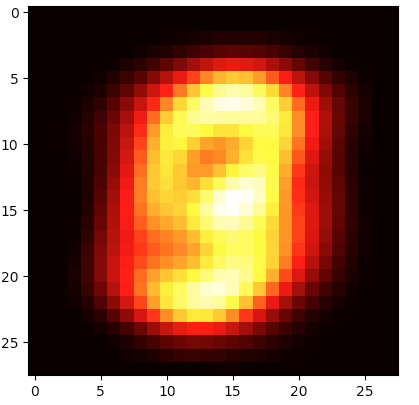
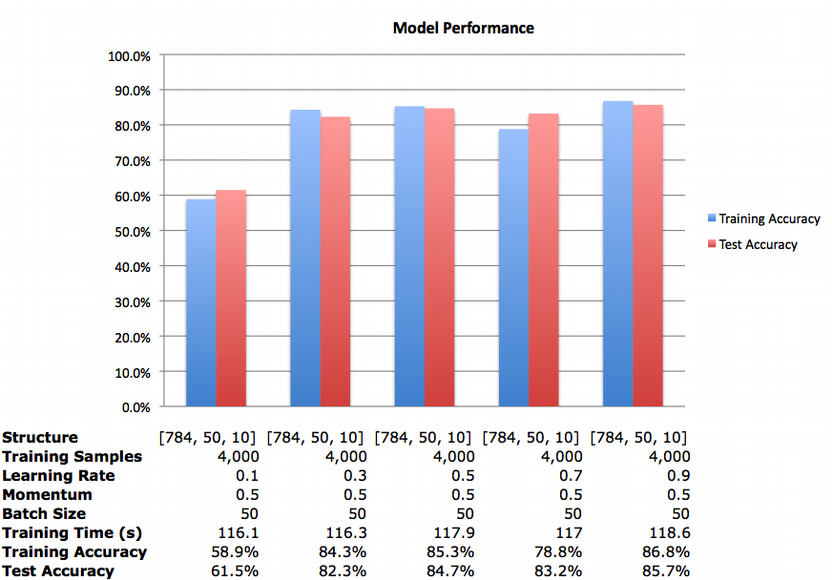
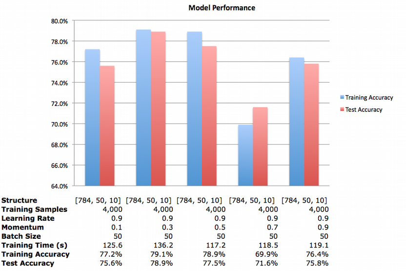
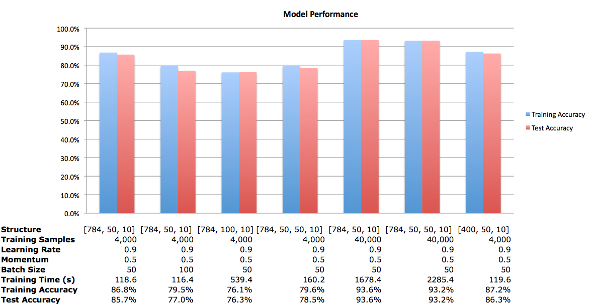
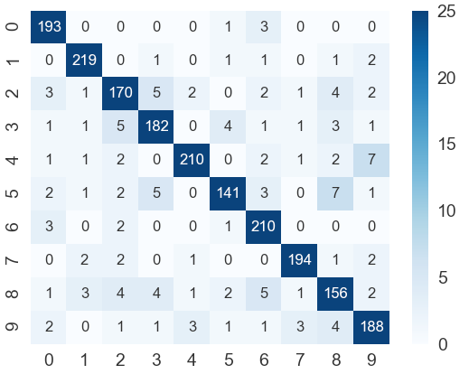
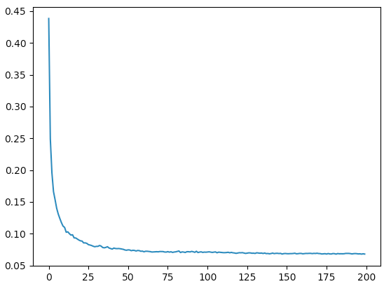
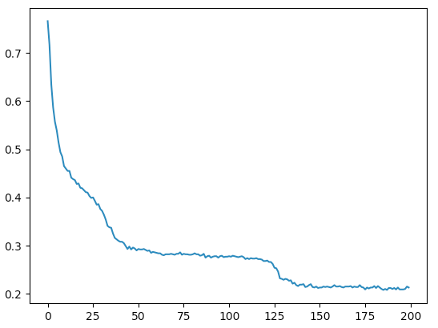
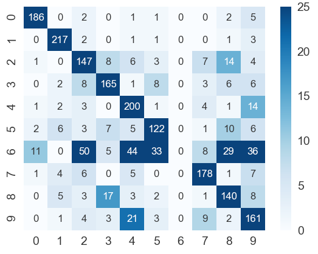

**Handwritten Digit Recognition with a Multilayer Perceptron**

Author:Jie Tao, Joel Smith

**Techniques Utilized to Increase Code Efficiency**

**       ** We used a modular approach to this problem, with different functions for training, testing, data preprocessing, and combining it all. This resulted in an easy-to-follow code for a fairly advanced topic for both of us.

**       ** The data normalization was achieved by simply dividing each value by 255. We created a heatmap of the mean value of each column of the raw data CSV file so we could determine which cells we could remove in order to decrease inputs and extraneous data. The heatmap, shown in Figure 1, reveals that there are about four rows above and below, and four columns to the left and to the right of most of the important data.

Figure 1. Heatmap of the mean values of all 40,000 training samples.

**       ** In an attempt to remove extra cells around the majority of the numbers, we changed each 28 x 28 sample to 20 x 20 pixels. This meant going from 784 pixels per image to just 400. As this was implemented late in the two-week period, we do not have much experimentation with this new, reduced input data. We also were not able to get a visualization of the reduced input data due to the time frame.

 We save the network structure into the npy files, which means we don&#39;t have to train these models again. They can be used for prediction or validation directly.

**Network Architecture**

**       ** For the structure of the MLP, we decided on one hidden layer with 50 neurons. There are 784 input neurons and ten output neurons, if we do not remove the primarily blank cells. There is one input neuron for each column of shading data in the CSV file. Similarly, there is one output neuron for each possible output: zero through ten. There are 400 input neurons for the models where we removed the excess white space.

 We decided to construct the MLP with one hidden layer with 50 neurons. Fifty was an arbitrary number we chose that fit the criteria of being between 784 and 10. Weight is initialized by random numbers following normal distribution of mean 0 and variance 1.

**Effectiveness of Classifier**

To assess the effectiveness of the classifier, we ran a manual grid search. The plan was to alter network structures, learning rate, momentum, and the batch size. For this grid search, we primarily used 4,000 training samples in order to speed up the training process.

 

Figure 3. Model performance with varied learning rates.

Figure 3 shows how the performance of the model changes with a change to the learning rate while keeping the rest of the parameters constant. While it appears that a small learning rate leads to poorer performance, each model was trained only once. So it is possible that the model with the learning rate of 0.1 was evolving too slowly and encountered a local minima in the given epochs and with a different set of initializations, the model would reach the global minima leading to a higher accuracy. Also, a larger number of epochs (we used 200) would help the model improve performance as it would have more time to reach a global minima. The randomness could be dealt with by either running each model many times to find a consistent accuracy, or randomly initializing the weights once and then using those for all models.

From here, we decided to investigate how the performance changes when the momentum is altered. We kept the learning rate at 0.9, as that yielded the best model above.

 

Figure 4. Model performance with varied momentum.

It appears that a small to medium value for momentum yields a better performance for a given set of parameters. A large learning rate and momentum could lead to the model skipping over the global minima. Again, the discrepancies between models could be due to the random initializations of the weights.

 We then decided to investigate further into other parameters. Using the combination of 0.9 as the learning rate and 0.5 for momentum, we trained several more models.

 

Figure 5. Model performance with varied training samples, batch sizes, and network structures.

 The model with the best performance here is that with 784 inputs, one hidden layer of 50 neurons, a learning rate of 0.9, momentum of 0.5, a mini-batch size of 50, and trained on all 40,000 training samples. With a test accuracy of 93.6%, this is nearly an 8% increase in accuracy of a similar model trained on 4,000 samples. The confusion matrix can be seen in Figure 6. However, this model took 28 minutes to train, while the model trained on 4,000 samples took less than two. Twenty-eight minutes is a very short time to train a neural network, yet over 85% test accuracy with a sub two-minute training time is more conducive to our experimentation.

 For this run of the model with the reduced input of 400 neurons, there was a slight increase in accuracy, with a similar training time. There was not as much training time saved as I thought there would be, yet I believe decreasing the amount of data and getting a similar result is a positive. This method could save time over a larger set of training samples and it will save space, so more training samples could be used for the same amount of memory, which could improve model accuracy.

 

Figure 6. Confusion matrix for the best model.

 Adding a second hidden layer of 50 neurons did not appear to increase the accuracy of the model. It did, however, increase the training time. More experimentation is required to determine the full effect of additional hidden layers. My first test would be to decrease the number of neurons in the second hidden layer and find out the result.

 Increasing the batch size seemed to have decreased the accuracy a small amount. From our two models to compare, when the batch size increased from 50 to 100, the test accuracy decreased from 85.7% to 77.0%.

 Increasing the number of neurons in the hidden layer also seemed to decrease the model accuracy. Going from 50 neurons to 100 neurons, the test accuracy decreased from 85.7% to 76.3%. Meanwhile, the training time significantly increased, rising to nearly nine minutes from about two.

The model with two hidden layers of 50 neurons each trained on all 40,000 training samples seemed to converge the fastest of the above models. Figure 7 below shows the training error against the epoch. This is apparent when comparing Figure 7 to Figure 8, which is the training error against the epoch for the model with one hidden layer of 50 neurons trained on 4,000 samples. Both models had the same parameters otherwise.

 

Figure 7. Training error for each epoch for the model with two hidden layers of 50 neurons each.

 

Figure 8. Training error for each epoch for the model with one hidden layer of 50 neurons.

A point of interest discovered while going through this grid search is that for the models with one hidden layer of 50 neurons and trained on 4,000 samples, one digit was consistently incorrectly identified. The digit incorrectly classified changed from model to model. The confusion matrix in Figure 9 is from the model with one 50-neuron hidden layer with a learning rate of 0.9 and momentum of 0.9. This did not happen with the two-hidden layer network, even though that was also trained on only 4,000 samples.

 

Figure 9. Confusion matrix of the model with one 50-neuron hidden layer. This model did not correctly classify the digit 6.

 We are interested in examining how other parameters influence the model such as an adaptive learning rate, and an adaptive momentum. These would likely be the first parameters we would implement in the code if we had more time. Two ideas we had for the adaptive learning rate are a step decay or exponential decay. We would look into an increasing momentum over time.

**Training Time**

 The models trained in our experimentation took anywhere from just under two minutes to 38 minutes to train. While 38 minutes to train a neural network is not long compared to other networks, it is a long time when trying to compare models through multiple experiments in a two-week time frame.

**Type of Training**

**       ** We decided to use mini-batch training as we thought it would give the best combination of coding flexibility and performance. Since it is easy to adjust batch size close to total sample number, we can get the results by two different approaches.

**Appendix I - Main Function Description**

- mlp.mlp(learning rate, momentum, size, epoch, load, save)

 This function is designed to initial the network. It also provides ability to reuse trained MLP to predict with new data. In the test process, set load =1, save=0.

- --&quot;Size&quot;: could be any one dimension array, the number of element means how many layers in the network
- --&quot;Load&quot;: 0= without load structure; 1= load structure
- --&quot;Save&quot;: 0= without save structure; 1= save structure

- mlp.miniBatch(training\_data, batch size, validationdata)

 This function is designed to training and validation with a given mini batch.

- --Batch\_size: mini batch size

- Others

- --whitecells: create a heatmap of the mean value of each column of raw data
- --confusion\_matrix: create a confusion matrix
- --cutwhitespace: reduce white space for raw data
- --plt.plot: create trend plot for error rate

